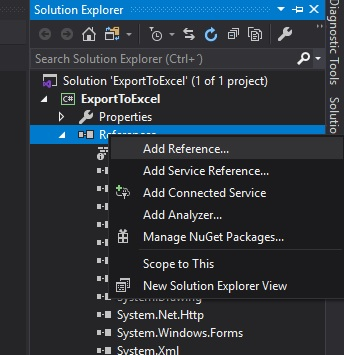
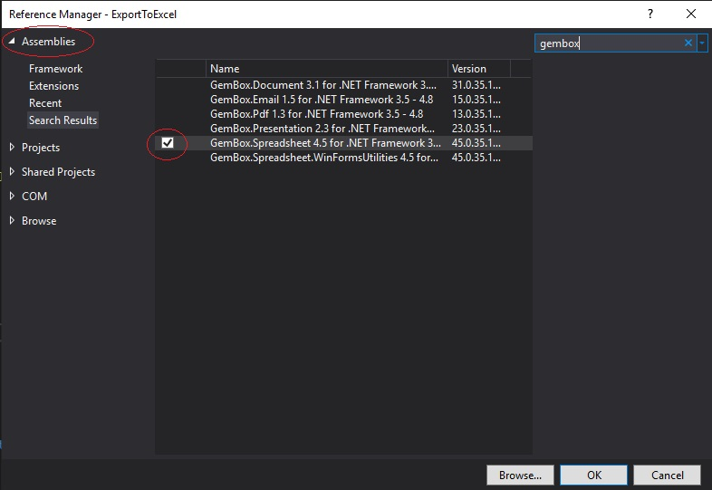

# ExportToExcel
CsharpForm Export a datagridview to Excel, Pdf, Jpg, etc file.

This example use the component GemBox for MIcrosoft .Net with c#.

Download Spreadsheet component in this link:
https://www.gemboxsoftware.com/spreadsheet/free-version

Or Download component Bundle in this link:
https://www.gemboxsoftware.com/bundle

* Add Reference:

* Find:

# Excel documentation

https://www.gemboxsoftware.com/spreadsheet/examples/c-sharp-vb-net-excel-style-formatting/202

https://www.gemboxsoftware.com/spreadsheet/examples/excel-cell-inline-formatting/203
